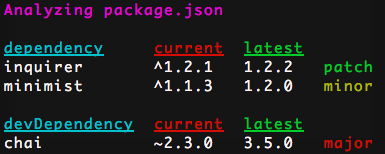
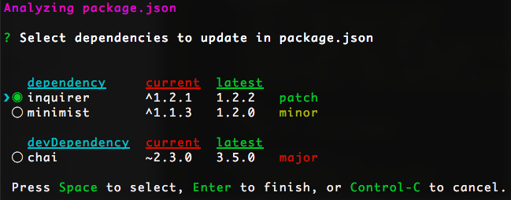

[](https://codeship.com/projects/178400)
[](https://codecov.io/gh/moroshko/analyze-deps-cli)
[](https://www.bithound.io/github/moroshko/analyze-deps-cli)
[](https://npmjs.org/package/analyze-deps-cli)

# Analyze Deps CLI

Compare dependencies in package.json to the latest available versions.

## Installation

```shell
npm install -g analyze-deps-cli
```

## Usage

### Display mode (default)

```shell
deps
```



`deps` simply outputs the packages which version range specified in `package.json` can be updated to include only the latest version.

By default, `deps` will analyze `package.json` found in `./`, the directory where `deps` is run. If not found, it will try `../`, then `../../` and so on.

You can also specify the `package.json` location like this:

```shell
deps -p some/other/location
```

### Interactive mode

```shell
deps -i
```



or, with a specified location:

```shell
deps -i -p some/other/location
```

## Related

* [analyze-deps](https://github.com/moroshko/analyze-deps) - API for this module

## License

[MIT](http://moroshko.mit-license.org)
